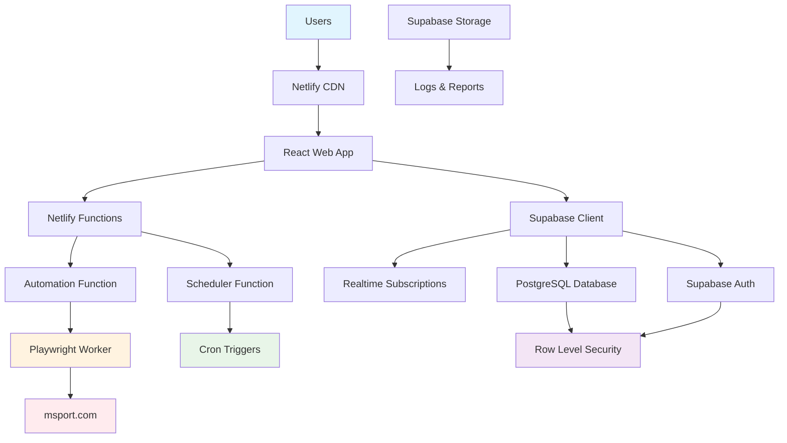

## Development Workflow

Define the development setup and workflow for the Supabase + Netlify fullstack application.

### Local Development Setup

#### Prerequisites

```bash
# Install Node.js 18+ and npm
node --version  # Should be 18.0.0 or higher
npm --version   # Should be 8.0.0 or higher

# Install global dependencies
npm install -g netlify-cli
npm install -g supabase
```

#### Initial Setup

```bash
# Clone and setup project
git clone <repository-url>
cd betting-scheduler
npm install

# Setup environment variables
cp .env.example .env.local
# Edit .env.local with your Supabase and Netlify values

# Start Supabase local development
supabase start

# Generate TypeScript types from Supabase
npm run generate-types

# Install Playwright browsers
npx playwright install

# Seed database with test data
npm run db:seed
```

#### Development Commands

```bash
# Start all services concurrently
npm run dev

# Individual services
npm run dev:web        # Frontend only (Vite dev server)
npm run dev:functions  # Netlify functions only
npm run dev:supabase   # Supabase local instance

# Database management
npm run db:reset       # Reset local database
npm run db:push        # Push schema changes
npm run db:pull        # Pull remote schema changes

# Testing
npm run test           # Run all tests
npm run test:web       # Frontend tests only
npm run test:functions # Function tests only
npm run test:e2e       # End-to-end tests

# Type checking and linting
npm run type-check     # TypeScript type checking
npm run lint           # ESLint across all packages
npm run format         # Prettier formatting
```

### Environment Configuration

#### Required Environment Variables

```bash
# Frontend (.env.local)
VITE_SUPABASE_URL=https://your-project.supabase.co
VITE_SUPABASE_ANON_KEY=your-anon-key
VITE_APP_ENV=development

# Netlify Functions (.env)
SUPABASE_URL=https://your-project.supabase.co
SUPABASE_SERVICE_ROLE_KEY=your-service-role-key
ENCRYPTION_KEY=your-32-char-encryption-key
MSPORT_BASE_URL=https://www.msport.com/gh/web

# Shared environment
DATABASE_URL=postgresql://localhost:54322/postgres
PLAYWRIGHT_HEADLESS=true
LOG_LEVEL=info
```

## Deployment Architecture

Define deployment strategy for the Supabase + Netlify stack.

### Deployment Strategy

**Frontend Deployment:**
- **Platform:** Netlify with automatic Git deployments
- **Build Command:** `npm run build:web`
- **Output Directory:** `apps/web/dist`
- **CDN/Edge:** Global CDN with automatic optimization

**Backend Deployment:**
- **Platform:** Netlify Functions with automatic deployment
- **Build Command:** `npm run build:functions`
- **Deployment Method:** Git-based continuous deployment
- **Runtime:** Node.js 18.x with 10-second timeout

**Database Deployment:**
- **Platform:** Supabase hosted PostgreSQL
- **Migration Strategy:** Automatic migrations via Supabase CLI
- **Backup Strategy:** Automatic daily backups with 30-day retention

### CI/CD Pipeline

```yaml
# .github/workflows/deploy.yaml
name: Deploy to Production

on:
  push:
    branches: [main]

jobs:
  test:
    runs-on: ubuntu-latest
    steps:
      - uses: actions/checkout@v4
      - uses: actions/setup-node@v4
        with:
          node-version: '18'
          cache: 'npm'
      
      - run: npm ci
      - run: npm run type-check
      - run: npm run lint
      - run: npm run test
      
  deploy:
    needs: test
    runs-on: ubuntu-latest
    steps:
      - uses: actions/checkout@v4
      - uses: actions/setup-node@v4
        with:
          node-version: '18'
          cache: 'npm'
      
      - run: npm ci
      - run: npm run build
      
      # Deploy to Netlify
      - uses: netlify/actions/cli@master
        with:
          args: deploy --prod --dir=apps/web/dist
        env:
          NETLIFY_AUTH_TOKEN: ${{ secrets.NETLIFY_AUTH_TOKEN }}
          NETLIFY_SITE_ID: ${{ secrets.NETLIFY_SITE_ID }}
      
      # Run database migrations
      - run: npx supabase db push
        env:
          SUPABASE_ACCESS_TOKEN: ${{ secrets.SUPABASE_ACCESS_TOKEN }}
          SUPABASE_PROJECT_ID: ${{ secrets.SUPABASE_PROJECT_ID }}
```

### Environments

| Environment | Frontend URL | Backend URL | Purpose |
|-------------|-------------|-------------|---------|
| Development | http://localhost:5173 | http://localhost:8888/.netlify/functions | Local development |
| Staging | https://staging--betting-scheduler.netlify.app | https://staging--betting-scheduler.netlify.app/.netlify/functions | Pre-production testing |
| Production | https://bettingscheduler.com | https://bettingscheduler.com/.netlify/functions | Live environment |

## Security and Performance

Define security and performance considerations for the Supabase + Netlify stack.

### Security Requirements

**Frontend Security:**
- CSP Headers: `default-src 'self'; connect-src 'self' https://*.supabase.co; script-src 'self' 'unsafe-inline'`
- XSS Prevention: Automatic escaping via React, Content Security Policy
- Secure Storage: Supabase handles JWT storage securely in httpOnly cookies

**Backend Security:**
- Input Validation: Joi/Zod validation for all function inputs
- Rate Limiting: Netlify's built-in rate limiting plus custom implementation
- CORS Policy: Restricted to frontend domain only

**Database Security:**
- Row Level Security: All tables use RLS policies for user data isolation
- Encryption at Rest: Supabase provides automatic encryption
- Connection Security: All connections over TLS 1.3

**Authentication Security:**
- Token Storage: Supabase handles secure JWT storage and refresh
- Session Management: Automatic session refresh and secure logout
- Password Policy: Minimum 12 characters, complexity requirements enforced

### Performance Optimization

**Frontend Performance:**
- Bundle Size Target: < 500KB initial bundle, code splitting for routes
- Loading Strategy: Lazy loading for non-# Automated Soccer Betting Scheduler Fullstack Architecture Document

## Introduction

This document outlines the complete fullstack architecture for the Automated Soccer Betting Scheduler, including backend systems, frontend implementation, and their integration. It serves as the single source of truth for AI-driven development, ensuring consistency across the entire technology stack.

This unified approach combines frontend web application, backend automation services, security infrastructure, and real-time communication systems to deliver reliable, secure automated betting execution.

### Starter Template or Existing Project

**N/A - Greenfield Project**

This is a new greenfield project requiring custom architecture for the unique combination of web automation, secure credential management, and real-time betting execution.

### Change Log

| Date | Version | Description | Author |
|------|---------|-------------|--------|
| 2025-01-16 | 1.0 | Initial fullstack architecture design | Architect |

## High Level Architecture

### Technical Summary

The system employs a **modern fullstack architecture** using **Supabase** as the backend-as-a-service and **Netlify** for frontend hosting and serverless functions. The frontend is a **React-based web application** that communicates directly with Supabase for database operations and real-time updates. **Playwright automation** runs in Netlify Functions for betting execution, while **Supabase's built-in authentication and encryption** handle user management and credential security. The architecture prioritizes **simplicity**, **cost-effectiveness**, and **rapid development** while maintaining **trust through transparency** and **reliable automation execution** for users who want "set it and forget it" money-making automation.

### Platform and Infrastructure Choice

**Platform:** Supabase + Netlify
**Key Services:** Supabase (PostgreSQL, Auth, Realtime, Storage), Netlify (Hosting, Functions, Edge)
**Deployment Host and Regions:** Global CDN with automatic geographic distribution

### Repository Structure

**Structure:** Monorepo with modern tooling
**Monorepo Tool:** npm workspaces
**Package Organization:** Frontend app, shared types, Netlify functions, and database schemas

### High Level Architecture Diagram



### Architectural Patterns

- **Fullstack Simplicity:** Single codebase with clear separation between frontend and serverless functions - _Rationale:_ Eliminates complexity of microservices while maintaining scalability through serverless functions
- **Database-First Architecture:** Supabase PostgreSQL with real-time subscriptions drives the application state - _Rationale:_ Leverages Supabase's built-in real-time capabilities for live betting updates
- **Serverless Automation:** Netlify Functions handle betting automation with cron scheduling - _Rationale:_ Cost-effective execution that scales automatically and handles variable betting loads
- **Row Level Security (RLS):** Database-level security policies enforce user data isolation - _Rationale:_ Provides robust security without complex API layers
- **Edge-First Deployment:** Global CDN distribution for optimal performance worldwide - _Rationale:_ Fast loading times critical for time-sensitive betting applications

## Tech Stack

This is the DEFINITIVE technology selection for the entire project. This table is the single source of truth - all development must use these exact versions.

### Technology Stack Table

| Category | Technology | Version | Purpose | Rationale |
|----------|------------|---------|---------|-----------|
| Frontend Language | TypeScript | 5.3.3 | Type-safe frontend development | Strong typing prevents runtime errors, excellent IDE support |
| Frontend Framework | React | 18.2.0 | Component-based UI library | Mature ecosystem, excellent performance, large talent pool |
| UI Component Library | Chakra UI | 2.8.2 | Accessible component system | Built-in accessibility, consistent design, trust-building components |
| State Management | Zustand | 4.4.7 | Lightweight state management | Simple API, TypeScript native, perfect for medium complexity |
| Backend Platform | Supabase | Latest | Backend-as-a-Service | PostgreSQL, Auth, Realtime, Storage in one platform |
| Database | PostgreSQL | 15+ (Supabase) | Primary data store via Supabase | ACID compliance, excellent performance, built-in real-time |
| Authentication | Supabase Auth | Latest | User authentication system | Built-in JWT, social auth, row-level security |
| Real-time | Supabase Realtime | Latest | Live data subscriptions | WebSocket-based real-time updates for betting activities |
| Serverless Functions | Netlify Functions | Latest | Automation and cron jobs | Playwright automation, scheduled betting execution |
| Hosting Platform | Netlify | Latest | Frontend hosting and deployment | Global CDN, continuous deployment, serverless functions |
| Automation Engine | Playwright | 1.41.0 | Web scraping and automation | Reliable msport.com interaction and bet placement |
| Build Tool | Vite | 5.0.10 | Frontend build system | Fast builds, excellent development experience |
| Package Manager | npm | 10.2.0 | Dependency management | Workspace support for monorepo structure |
| Frontend Testing | Jest + RTL | 29.7.0 | Component and unit testing | Industry standard, excellent React integration |
| E2E Testing | Playwright | 1.41.0 | End-to-end testing | Same tool used for betting automation |
| CSS Framework | Tailwind CSS | 3.4.1 | Utility-first styling | Consistent design system, small bundle size |
| Form Handling | React Hook Form | 7.48.2 | Form validation and management | Excellent performance, minimal re-renders |
| HTTP Client | Supabase Client | Latest | API communication | Built-in client for Supabase operations |
| Monitoring | Supabase Dashboard | Latest | System monitoring | Built-in analytics and monitoring |
| Version Control | Git + GitHub | Latest | Source control and CI/CD | Integrated with Netlify for automatic deployments |

## Data Models

Define the core data models/entities that will be shared between frontend and backend.

### User

**Purpose:** Represents platform users who want automated betting services

**Key Attributes:**
- id: string (UUID) - Unique user identifier
- email: string - User's email address for authentication
- profile: UserProfile - User preferences and settings
- createdAt: Date - Account creation timestamp
- lastLoginAt: Date - Most recent login time

#### TypeScript Interface

```typescript
interface User {
  id: string;
  email: string;
  profile: UserProfile;
  createdAt: Date;
  updatedAt: Date;
  lastLoginAt: Date;
}

interface UserProfile {
  firstName: string;
  lastName: string;
  timezone: string;
  preferredCurrency: string;
  notificationSettings: NotificationSettings;
}

interface NotificationSettings {
  emailEnabled: boolean;
  smsEnabled: boolean;
  pushEnabled: boolean;
  activityAlerts: boolean;
  securityAlerts: boolean;
}
```

#### Relationships
- Has many BettingSchedules
- Has many BettingActivities
- Has one CredentialVault (encrypted)

### BettingSchedule

**Purpose:** Defines automated betting schedules configured by users

**Key Attributes:**
- id: string (UUID) - Unique schedule identifier
- userId: string - Reference to owning user
- name: string - User-defined schedule name
- startDate: Date - When automation begins
- endDate: Date - When automation ends
- dailyAmount: number - Amount to bet per day
- frequency: ScheduleFrequency - How often to bet
- status: ScheduleStatus - Current schedule state

#### TypeScript Interface

```typescript
interface BettingSchedule {
  id: string;
  userId: string;
  name: string;
  startDate: Date;
  endDate: Date;
  dailyAmount: number;
  frequency: ScheduleFrequency;
  preferredBetTypes: BetType[];
  riskControls: RiskControls;
  status: ScheduleStatus;
  createdAt: Date;
  updatedAt: Date;
}

enum ScheduleFrequency {
  DAILY = 'daily',
  WEEKDAYS = 'weekdays',
  WEEKENDS = 'weekends',
  EVERY_OTHER_DAY = 'every_other_day'
}

enum ScheduleStatus {
  DRAFT = 'draft',
  ACTIVE = 'active',
  PAUSED = 'paused',
  COMPLETED = 'completed',
  CANCELLED = 'cancelled'
}

interface RiskControls {
  dailyLossLimit: number;
  weeklyLossLimit: number;
  maxSingleBet: number;
  monthlySpendingCap: number;
}
```

#### Relationships
- Belongs to User
- Has many BettingActivities

### BettingActivity

**Purpose:** Records all betting actions and outcomes for transparency and reporting

**Key Attributes:**
- id: string (UUID) - Unique activity identifier
- userId: string - Reference to user
- scheduleId: string - Reference to originating schedule
- matchDetails: MatchInfo - Information about the soccer match
- betDetails: BetInfo - Bet type, amount, odds
- outcome: BetOutcome - Result of the bet
- timestamp: Date - When the bet was placed

#### TypeScript Interface

```typescript
interface BettingActivity {
  id: string;
  userId: string;
  scheduleId: string;
  matchDetails: MatchInfo;
  betDetails: BetInfo;
  outcome: BetOutcome;
  selectionReasoning: string;
  timestamp: Date;
  settledAt?: Date;
}

interface MatchInfo {
  homeTeam: string;
  awayTeam: string;
  league: string;
  startTime: Date;
  msportMatchId: string;
}

interface BetInfo {
  type: BetType;
  selection: string;
  stake: number;
  odds: number;
  potentialReturn: number;
  betId?: string; // msport bet reference
}

enum BetType {
  HOME_DRAW_AWAY = 'home_draw_away',
  OVER_UNDER_2_5 = 'over_under_2_5'
}

interface BetOutcome {
  status: 'pending' | 'won' | 'lost' | 'cancelled';
  actualReturn?: number;
  settledAt?: Date;
}
```

#### Relationships
- Belongs to User
- Belongs to BettingSchedule

### CredentialVault

**Purpose:** Securely stores encrypted msport.com login credentials

**Key Attributes:**
- userId: string - Reference to owning user
- encryptedCredentials: string - AES-256 encrypted credentials
- kmsKeyId: string - AWS KMS key reference
- lastValidated: Date - When credentials were last verified
- validationStatus: CredentialStatus - Current credential validity

#### TypeScript Interface

```typescript
interface CredentialVault {
  userId: string;
  encryptedCredentials: string;
  kmsKeyId: string;
  lastValidated: Date;
  validationStatus: CredentialStatus;
  createdAt: Date;
  updatedAt: Date;
}

enum CredentialStatus {
  VALID = 'valid',
  INVALID = 'invalid',
  EXPIRED = 'expired',
  NEEDS_VERIFICATION = 'needs_verification'
}
```

#### Relationships
- Belongs to User (one-to-one)

## API Specification

### REST API Specification

```yaml
openapi: 3.0.0
info:
  title: Automated Soccer Betting Scheduler API
  version: 1.0.0
  description: REST API for automated betting platform
servers:
  - url: https://api.bettingscheduler.com/v1
    description: Production API
  - url: https://api-dev.bettingscheduler.com/v1
    description: Development API

paths:
  /auth/login:
    post:
      summary: User authentication
      requestBody:
        required: true
        content:
          application/json:
            schema:
              type: object
              properties:
                email:
                  type: string
                  format: email
                password:
                  type: string
                  minLength: 12
      responses:
        '200':
          description: Authentication successful
          content:
            application/json:
              schema:
                type: object
                properties:
                  accessToken:
                    type: string
                  refreshToken:
                    type: string
                  user:
                    $ref: '#/components/schemas/User'

  /users/profile:
    get:
      summary: Get user profile
      security:
        - bearerAuth: []
      responses:
        '200':
          description: User profile
          content:
            application/json:
              schema:
                $ref: '#/components/schemas/User'
    put:
      summary: Update user profile
      security:
        - bearerAuth: []
      requestBody:
        required: true
        content:
          application/json:
            schema:
              $ref: '#/components/schemas/UserProfile'

  /credentials:
    post:
      summary: Store msport.com credentials
      security:
        - bearerAuth: []
      requestBody:
        required: true
        content:
          application/json:
            schema:
              type: object
              properties:
                username:
                  type: string
                password:
                  type: string
      responses:
        '201':
          description: Credentials stored successfully
        '400':
          description: Invalid credentials or validation failed

  /schedules:
    get:
      summary: Get user's betting schedules
      security:
        - bearerAuth: []
      responses:
        '200':
          description: List of betting schedules
          content:
            application/json:
              schema:
                type: array
                items:
                  $ref: '#/components/schemas/BettingSchedule'
    post:
      summary: Create new betting schedule
      security:
        - bearerAuth: []
      requestBody:
        required: true
        content:
          application/json:
            schema:
              $ref: '#/components/schemas/BettingSchedule'

  /schedules/{scheduleId}/control:
    post:
      summary: Control schedule (start/stop/pause)
      security:
        - bearerAuth: []
      parameters:
        - name: scheduleId
          in: path
          required: true
          schema:
            type: string
      requestBody:
        required: true
        content:
          application/json:
            schema:
              type: object
              properties:
                action:
                  type: string
                  enum: [start, stop, pause, resume]

  /activities:
    get:
      summary: Get betting activities
      security:
        - bearerAuth: []
      parameters:
        - name: startDate
          in: query
          schema:
            type: string
            format: date
        - name: endDate
          in: query
          schema:
            type: string
            format: date
        - name: status
          in: query
          schema:
            type: string
            enum: [pending, won, lost, cancelled]
      responses:
        '200':
          description: List of betting activities
          content:
            application/json:
              schema:
                type: array
                items:
                  $ref: '#/components/schemas/BettingActivity'

  /reports/performance:
    get:
      summary: Get performance analytics
      security:
        - bearerAuth: []
      parameters:
        - name: period
          in: query
          schema:
            type: string
            enum: [day, week, month, year]
      responses:
        '200':
          description: Performance metrics
          content:
            application/json:
              schema:
                type: object
                properties:
                  totalProfit:
                    type: number
                  winRate:
                    type: number
                  roi:
                    type: number
                  totalBets:
                    type: integer

components:
  securitySchemes:
    bearerAuth:
      type: http
      scheme: bearer
      bearerFormat: JWT
  schemas:
    User:
      type: object
      properties:
        id:
          type: string
        email:
          type: string
        profile:
          $ref: '#/components/schemas/UserProfile'
    UserProfile:
      type: object
      properties:
        firstName:
          type: string
        lastName:
          type: string
        timezone:
          type: string
        preferredCurrency:
          type: string
    BettingSchedule:
      type: object
      properties:
        id:
          type: string
        name:
          type: string
        startDate:
          type: string
          format: date
        endDate:
          type: string
          format: date
        dailyAmount:
          type: number
        frequency:
          type: string
          enum: [daily, weekdays, weekends, every_other_day]
        status:
          type: string
          enum: [draft, active, paused, completed, cancelled]
    BettingActivity:
      type: object
      properties:
        id:
          type: string
        matchDetails:
          type: object
        betDetails:
          type: object
        outcome:
          type: object
        timestamp:
          type: string
          format: date-time
```