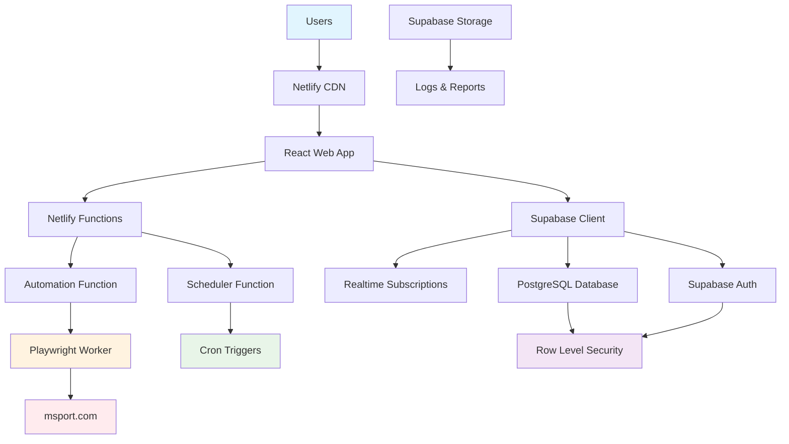

# High Level Architecture

## Technical Summary

The system employs a **modern fullstack architecture** using **Supabase** as the backend-as-a-service and **Netlify** for frontend hosting and serverless functions. The frontend is a **React-based web application** that communicates directly with Supabase for database operations and real-time updates. **Playwright automation** runs in Netlify Functions for betting execution, while **Supabase's built-in authentication and encryption** handle user management and credential security. The architecture prioritizes **simplicity**, **cost-effectiveness**, and **rapid development** while maintaining **trust through transparency** and **reliable automation execution** for users who want "set it and forget it" money-making automation.

## Platform and Infrastructure Choice

**Platform:** Supabase + Netlify
**Key Services:** Supabase (PostgreSQL, Auth, Realtime, Storage), Netlify (Hosting, Functions, Edge)
**Deployment Host and Regions:** Global CDN with automatic geographic distribution

## Repository Structure

**Structure:** Monorepo with modern tooling
**Monorepo Tool:** npm workspaces
**Package Organization:** Frontend app, shared types, Netlify functions, and database schemas

## High Level Architecture Diagram

## Architectural Patterns

- **Fullstack Simplicity:** Single codebase with clear separation between frontend and serverless functions - _Rationale:_ Eliminates complexity of microservices while maintaining scalability through serverless functions
- **Database-First Architecture:** Supabase PostgreSQL with real-time subscriptions drives the application state - _Rationale:_ Leverages Supabase's built-in real-time capabilities for live betting updates
- **Serverless Automation:** Netlify Functions handle betting automation with cron scheduling - _Rationale:_ Cost-effective execution that scales automatically and handles variable betting loads
- **Row Level Security (RLS):** Database-level security policies enforce user data isolation - _Rationale:_ Provides robust security without complex API layers
- **Edge-First Deployment:** Global CDN distribution for optimal performance worldwide - _Rationale:_ Fast loading times critical for time-sensitive betting applications
